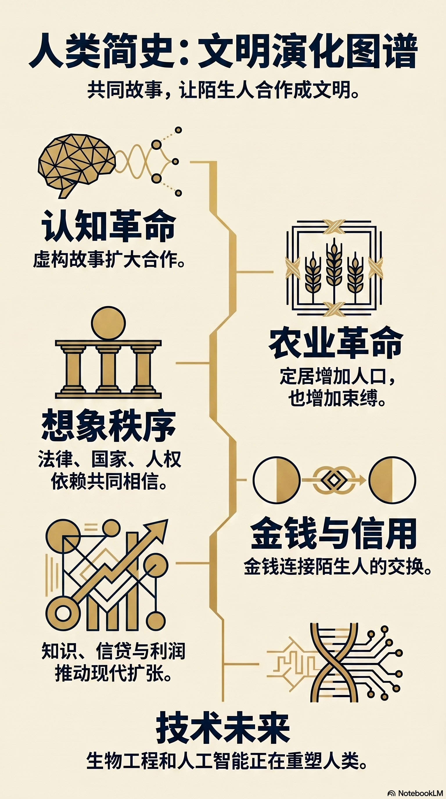
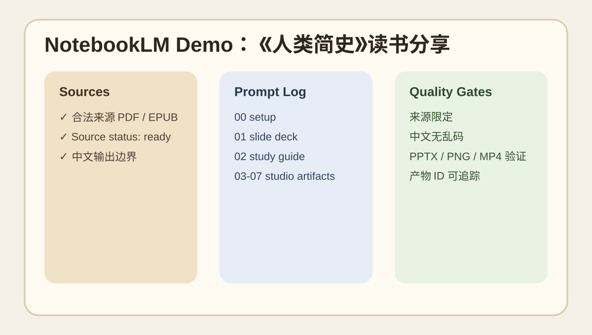
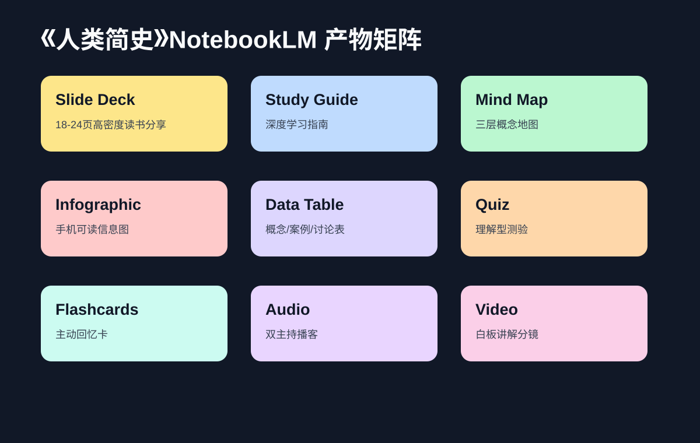
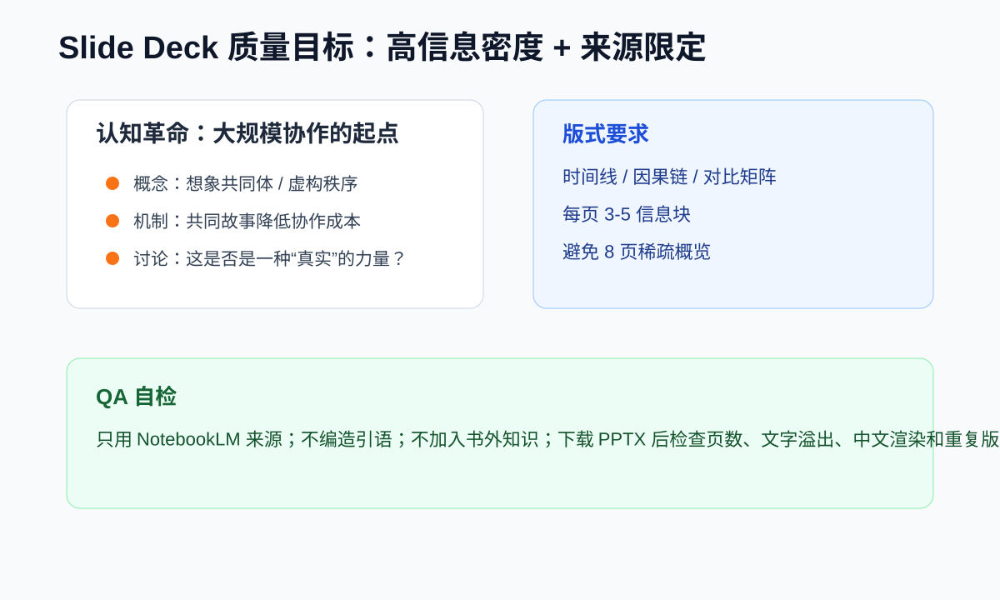
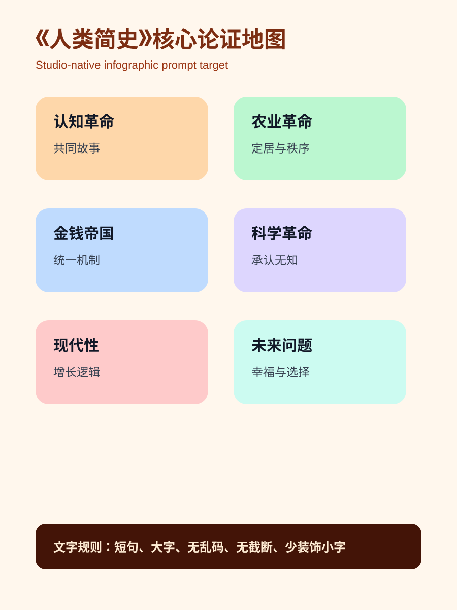

# Demo: 《人类简史》NotebookLM 工作流

This demo shows a best-practice NotebookLM workflow for turning a book notebook into reusable artifacts: slide deck, study guide/report, mind map, infographic, data table, quiz, flashcards, audio overview, and video overview.

> Copyright note: this repo does not include the book PDF, raw NotebookLM outputs, or verbatim copyrighted excerpts. The screenshots below are lightweight illustrative mockups that show target structure and artifact quality expectations. Reproduce the workflow with your own legally available source copy inside NotebookLM.

## Target outcome

| Artifact | Best-practice target | Prompt file |
|---|---|---|
| Notebook setup | One source-grounded notebook with ready source(s), Chinese output language, and a saved prompt log. | `prompts/00_notebook_setup.md` |
| Slide deck | Dense 18-24 slide book-sharing deck, with concrete concepts/cases and varied layouts. | `prompts/01_slide_deck.md` |
| Study guide/report | Deep Chinese study guide: core question, framework, chapter logic, misconceptions, discussion questions. | `prompts/02_study_guide.md` |
| Mind map | 3-level map: cognitive revolution, agriculture, imagined orders, empires, money, religion, science, modernity. | `prompts/03_mind_map.md` |
| Infographic | Mobile-friendly bento/grid visual with short Chinese labels and no garbled text. | `prompts/04_infographic.md` |
| Data table | Structured reuse table for concepts, evidence, examples, implications, and discussion hooks. | `prompts/05_data_table.md` |
| Quiz + flashcards | Understanding-oriented questions, not rote memorization. | `prompts/06_quiz_flashcards.md` |
| Audio + video | Source-grounded Chinese explainer/podcast with concrete examples and segment structure. | `prompts/07_audio_video.md` |

## Real artifacts from the Drive delivery

The real NotebookLM outputs that were already uploaded to Google Drive are indexed in [`drive_outputs/README.md`](drive_outputs/README.md). To keep git history lightweight, only small repo-friendly files are committed here; large PPTX/PDF/MP4 files stay on Drive.

Included locally:

- [`drive_outputs/sapiens_infographic_final.png`](drive_outputs/sapiens_infographic_final.png) — final Studio-native infographic preview.
- [`drive_outputs/prompts_drive_01.md`](drive_outputs/prompts_drive_01.md) and [`drive_outputs/prompts_drive_02.md`](drive_outputs/prompts_drive_02.md) — prompt logs from the artifact run.

Drive folder with the full artifact set:

- https://drive.google.com/drive/folders/1sZWcG6vdHnfLDLlt99UsWG56zAEHeMCo



## Demo screenshots / mock previews

These SVGs are illustrative structure previews for README browsing and PR review. They intentionally avoid private NotebookLM data and copyrighted book excerpts.









## Reproduce with NotebookLM CLI

Set the authenticated profile and create/use a notebook:

```bash
export NOTEBOOKLM_HOME="$HOME/.notebooklm/profiles/default"
notebooklm list --json
notebooklm create "《人类简史》读书分享 Demo" --json | tee /tmp/sapiens_create.json
```

Add your legally available source file or URL, then wait until sources are ready:

```bash
NB_ID=$(python3 - <<'PY'
import json
print(json.load(open('/tmp/sapiens_create.json'))['notebook']['id'])
PY
)
notebooklm source add /path/to/sapiens.pdf -n "$NB_ID" --json | tee /tmp/sapiens_source.json
notebooklm use "$NB_ID"
notebooklm source list --json
```

Generate artifacts with the prompt files in `prompts/`. Save every prompt and every JSON response:

```bash
OUT=/tmp/notebooklm_sapiens_demo
mkdir -p "$OUT"
cp demos/sapiens/prompts/*.md "$OUT/"

notebooklm generate mind-map --json > "$OUT/generate_mind_map.json"
notebooklm generate report --format study-guide --append "$(cat demos/sapiens/prompts/02_study_guide.md)" --language zh_Hans --retry 2 --json > "$OUT/generate_report.json"
notebooklm generate slide-deck "$(cat demos/sapiens/prompts/01_slide_deck.md)" --format detailed --length default --language zh_Hans --retry 2 --json > "$OUT/generate_slide_deck.json"
notebooklm generate infographic "$(cat demos/sapiens/prompts/04_infographic.md)" --orientation portrait --detail detailed --style bento-grid --language zh_Hans --retry 2 --json > "$OUT/generate_infographic.json"
notebooklm generate data-table "$(cat demos/sapiens/prompts/05_data_table.md)" --language zh_Hans --retry 2 --json > "$OUT/generate_data_table.json"
```

Quiz and flashcards do not always accept `--language`, so put Chinese explicitly in the prompt:

```bash
notebooklm generate quiz "$(cat demos/sapiens/prompts/06_quiz_flashcards.md)" --difficulty medium --quantity standard --retry 2 --json > "$OUT/generate_quiz.json"
notebooklm generate flashcards "$(cat demos/sapiens/prompts/06_quiz_flashcards.md)" --difficulty medium --quantity standard --retry 2 --json > "$OUT/generate_flashcards.json"
```

Audio and video are slower; start them separately and keep artifact IDs:

```bash
notebooklm generate audio "$(cat demos/sapiens/prompts/07_audio_video.md)" --format deep-dive --length default --language zh_Hans --retry 2 --json > "$OUT/generate_audio.json"
notebooklm generate video "$(cat demos/sapiens/prompts/07_audio_video.md)" --format explainer --style whiteboard --language zh_Hans --retry 2 --json > "$OUT/generate_video.json"
notebooklm artifact list --json > "$OUT/artifacts_after_start.json"
```

## Quality checklist

- Sources are `ready` before generation.
- Every prompt says “only use notebook sources / 不要加入书外知识”.
- Slide deck uses Detailed mode and targets 18-24 slides, not a sparse 8-10 page overview.
- Visual artifacts are QA'd for Chinese text errors: 乱码、错字、截断、小字过多.
- PPTX is downloaded and checked, not only PDF.
- Long-running audio/video jobs are recorded with artifact IDs and can be resumed later.
- Generated files go to an output directory; private PDFs, auth state, and raw copyrighted excerpts are not committed.
