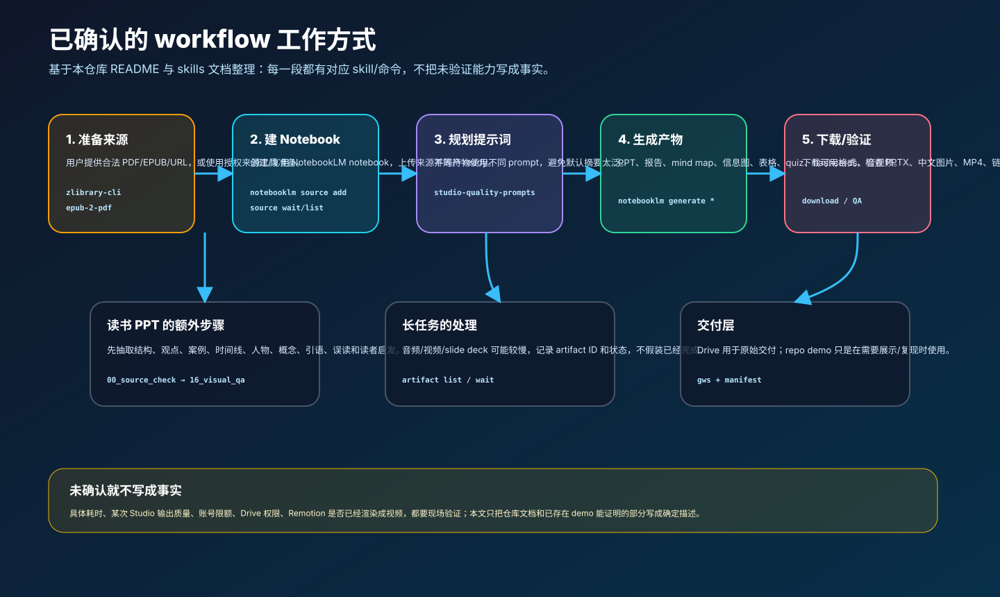

# 用 Hermes + NotebookLM，把一本书变成一套可分享的知识作品集

这篇文章面向第一次看到 `notebooklm-workflow` 的用户：你不需要先关心 repo 里放了哪些压缩文件，也不需要先理解每个脚本的实现。你真正关心的是：给它一本书或一组资料，它到底如何工作，能产出什么，哪些步骤是自动化的，哪些地方仍然需要确认。

先说明边界：本文根据本仓库的 `README.md` 和 `skills/` 文档整理，并结合仓库里已经存在的《人类简史》demo 展示效果。没有现场重新跑一遍完整 NotebookLM 生成流程，因此凡是依赖账号状态、NotebookLM 后端、具体 artifact 质量、生成耗时、Drive 权限或 Remotion 渲染结果的地方，都会明确写成“需要现场确认”，不会当作已验证事实。


## 1. 这个 workflow 解决什么问题？

直接把一本书丢给 AI，让它“总结一下”，通常会得到一份还不错但很难复用的摘要。读书分享、课程准备、社群传播或内部培训需要的不只是摘要，而是一组不同形态的材料：

- 可以上台讲的 PPT；
- 可以深读的学习指南；
- 可以看全局结构的思维导图；
- 可以传播的中文信息图；
- 可以二次加工的数据表；
- 可以检验理解的 quiz 和 flashcards；
- 可以异步消费的 audio/video overview；
- 可以复用到下一本书的一组 prompts 和 QA 记录。

`notebooklm-workflow` 的目标，就是把这些材料从一次性的“生成结果”，变成一条可重复运行的知识生产流水线。


## 2. 它不是一个大脚本，而是一组 skills 的接力

这个仓库里有 9 个 skill。它们不是并列的命令集合，而是按工作流分层：

| 阶段 | 已确认的 skill / 目录 | 它负责什么 |
|---|---|---|
| 来源准备 | `zlibrary-cli`、`epub-2-pdf`、`upload-books-to-notebooklm`、`blog-2-notebooklm` | 准备合法来源，把 EPUB/PDF/URL/博客文章变成 NotebookLM 可摄取的来源。 |
| Notebook 操作 | `notebooklm` | 认证、创建/列出 notebook、添加来源、等待 indexing、生成 Studio artifacts、下载产物、查看 artifact 状态。 |
| 读书分享 PPT | `notebooklm-book-ppt-workflow` | 在生成 PPT 前，先从 NotebookLM 来源中抽取结构、观点、案例、时间线、人物、概念、引语和误读风险，并做 fact check。 |
| Studio 产物质量 | `notebooklm-studio-quality-prompts` | 为 slide deck、report、mind map、infographic、data table、quiz、flashcards、audio、video 分别准备高质量 prompt。 |
| 富信息量幻灯片 | `notebooklm-rich-slide-decks` + PowerPoint tooling | 关注 PPT 信息密度、PPTX 校验、视觉 QA、预览页抽取等。 |
| 交付与展示 | `notebooklm-artifacts-to-drive` | 把原始产物放到 Google Drive；在需要 repo/demo 展示时，再生成 manifest、预览图和轻量副本。 |

关键点是：Agent 不是从头“猜”流程，而是根据用户请求加载对应 skill。例如：

- “把这本书做成 NotebookLM 笔记本”会走 `upload-books-to-notebooklm` + `notebooklm`；
- “把 EPUB 先变 PDF 再上传”会走 `epub-2-pdf` -> `upload-books-to-notebooklm` -> `notebooklm`；
- “做一套读书分享 PPT”会走 `notebooklm-book-ppt-workflow`；
- “生成所有 Studio 产物”会走 `notebooklm-studio-quality-prompts` + `notebooklm generate ...`；
- “把产物整理成 demo”才会走 `notebooklm-artifacts-to-drive` 的 repo-friendly 展示流程。



## 3. 一次完整运行，实际发生什么？

根据仓库 README 和 skills，一次完整运行可以拆成 7 步。

### 第一步：确认来源

用户先提供或指定合法来源：PDF、EPUB、URL、博客文章，或已经存在的 NotebookLM notebook。

可选工具包括：

- `epub-2-pdf`：把 EPUB 转成更适合上传和阅读的 PDF；
- `upload-books-to-notebooklm`：批量上传本地书籍文件；
- `blog-2-notebooklm`：把官方博客/文章 URL 导入 NotebookLM；
- `zlibrary-cli`：只在用户授权且合规的前提下使用，且本仓库明确不做自动绕过限额的账号轮换。

需要确认的地方：来源文件是否可用、是否有合法使用权、是否能被 NotebookLM 成功索引。这些不能靠文章保证，必须现场检查。

### 第二步：创建或复用 NotebookLM notebook

`notebooklm` skill 提供的是核心 NotebookLM CLI/API 操作。典型动作是：

```bash
notebooklm list --json
notebooklm create "<notebook title>" --json
notebooklm source add ./book.pdf -n <full-notebook-uuid> --json
notebooklm source list --json
```

确认来源进入 notebook 后，还要等它变成 `ready`。如果 source 还在 `processing` 或 `error`，后续生成就不可靠。

需要确认的地方：NotebookLM 登录状态、账号地区/网络是否可用、source 是否 ready、notebook UUID 是否完整。

### 第三步：按产物类型规划 prompt

这是 workflow 和“随手点生成”的核心差异。

`notebooklm-studio-quality-prompts` 明确要求：不同 artifact 不能用同一套默认 prompt。PPT、学习指南、信息图、quiz、flashcards、audio、video 的目标不同，prompt 也应该不同。

例如：

- PPT 要求高信息密度、页数、每页信息块、具体案例和视觉结构；
- Study guide 要求核心框架、概念解释、误区、练习清单；
- Infographic 要求短中文文本、视觉隐喻、分区和中文渲染 QA；
- Quiz 要求检验理解，而不是背概念；
- Video 要求分镜，而不是百科式旁白。


### 第四步：生成 Studio artifacts

确认来源 ready 后，才启动 NotebookLM Studio 产物生成。skills 中明确列出的 artifact 类型包括：

| Artifact | 典型输出 | 用途 |
|---|---|---|
| Slide deck | PPTX / PDF | 读书分享、课程讲解、会议汇报 |
| Report / study guide | Markdown | 深读、复盘、文章再加工 |
| Mind map | JSON | 看全局结构，后续可视化 |
| Infographic | PNG | 社交传播、README 首屏展示 |
| Data table | CSV | 结构化检索和二次加工 |
| Quiz | JSON / Markdown / HTML | 检验理解 |
| Flashcards | JSON / Markdown / HTML | 主动回忆和复习 |
| Audio overview | MP3 | 播客式异步消费 |
| Video overview | MP4 | 视频讲解/白板讲解 |

需要确认的地方：NotebookLM Studio 生成有不稳定因素。skills 明确写到，音频、视频、quiz、flashcards、infographic、slide deck 可能遇到 rate limit 或长时间 pending。不能在没有下载和验证的情况下宣称“已经生成成功”。

### 第五步：对书籍 PPT 做更严格的 source-grounding

如果目标是“读书分享 PPT”，workflow 会比普通 artifact 生成更严格。

`notebooklm-book-ppt-workflow` 的硬规则是：PPT 中的章节、观点、案例、时间线、人物、引语和结论必须来自 NotebookLM 对书籍来源的提取，Agent 不能凭模型记忆补充。

它要求保留一组中间文件：

```text
00_source_check.md
01_book_structure.md
02_core_ideas.md
03_key_cases.md
04_timeline.md
05_people.md
06_concepts.md
07_quotes.md
08_misreadings.md
09_reader_takeaways.md
10_content_brief.md
11_slide_outline.md
12_slide_script.md
13_fact_check.md
14_slide_script_verified.md
15_ppt_content_qa.md
16_ppt_visual_qa.md
```

这不是为了“显得复杂”，而是为了降低三类风险：

1. 内容风险：PPT 混入书外知识、模型记忆或假引语；
2. 结构风险：PPT 看起来漂亮，但没有覆盖书中的核心论证；
3. 复用风险：下次想改页数、风格或重点时，找不到中间依据。


《人类简史》demo 中已经放了几页 PPT 预览，可以作为信息密度和展示风格的参考：

| Cover | Three revolutions | Wheat trap |
|---|---|---|
|  |  |  |
| Universal orders | Modern engine | Future DNA |
|  |  |  |

这里需要明确：这些预览图证明“本 repo 已有一个 demo 展示目标形态”，但不证明每本书都会自动得到同等质量。新书仍然需要来源检查、prompt 规划、生成和 QA。

### 第六步：下载并验证产物

workflow 不把“生成请求发出去了”当成完成。真正完成至少需要：

- artifact status 显示完成；
- 文件能下载；
- PPTX 能通过 archive 检查，例如 `unzip -t`；
- PDF 页数能读；
- MP4 能用 `ffprobe` 读出时长/编码信息；
- 中文信息图/幻灯片没有明显乱码、错字、截断或小字过多；
- Markdown/manifest/prompt logs 不含 OAuth token、cookie、session、password 等敏感信息。

这一步也解释了为什么 workflow 里会出现 QA 和 manifest：它们服务的是交付可靠性，而不是给外部读者增加负担。

### 第七步：交付给用户，而不是只留在本地

`notebooklm-artifacts-to-drive` 的默认交付思路是：把 NotebookLM 产物按下面路径放到 Google Drive：

```text
NotebookLM/<notebook name>/<artifact file>
```

这对用户最重要，因为原始 PPTX、PDF、MP4、PNG 等文件通常应该以可打开、可下载、可分享的方式交付。

repo 里的压缩版、截图和 manifest 只是第二层用途：当你想把一次 workflow 变成可展示、可复现的 demo 时，才需要它们。普通用户只需要拿到 Drive 里的最终产物即可。

## 4. 用户真正会得到什么？

如果 workflow 完整跑通，用户可以期待得到一套“知识作品集”，而不是一份单独摘要：

| 你要做的事 | 对应产物 | 价值 |
|---|---|---|
| 做读书会/分享 | 详细 PPT + PDF | 可直接讲，保留概念、案例和逻辑链。 |
| 自己深入理解 | Study guide | 有框架、误区、问题和复盘线索。 |
| 快速看全局 | Mind map | 把章节和概念关系展开。 |
| 社交传播 | Infographic | 用一张图讲清核心框架。 |
| 二次创作 | Data table | 把概念、案例、表达和动作结构化。 |
| 学习检测 | Quiz / flashcards | 检验理解，而不是只看过摘要。 |
| 异步消费 | Audio / video | 适合通勤、复习或课程预热。 |


## 5. Remotion 在这里应该怎么用？

目前仓库里加入的是 Remotion storyboard 和一个 `.tsx` 组件草稿，不是已经完整打包、渲染并验证过的视频项目。

它的合理定位是：把这篇文章和 demo 中的静态资产，进一步变成 60 秒工作流讲解视频。


当前草稿文件在：

```text
docs/assets/notebooklm-workflow/remotion-workflow-teaser.tsx
```

它描述了 6 个片段：

| 时间 | 段落 | 内容 |
|---|---|---|
| 00-06s | 问题开场 | 一本书的知识会散落成很多文件和产物。 |
| 06-16s | 技能接力 | source、notebook、prompt、Studio、QA、delivery 分层协作。 |
| 16-30s | Notebook 核心 | 等待 source ready，围绕同一 notebook 生成多种 artifact。 |
| 30-42s | 审计与 QA | 保存 prompt log、artifact ID、manifest 和验证记录。 |
| 42-54s | 交付分流 | 原始产物交付到 Drive；demo 展示再整理预览资产。 |
| 54-60s | Demo | 展示 README、PPT preview 和 artifact gallery。 |

需要确认的地方：要真正使用 Remotion，还需要一个 Remotion 项目、依赖安装、入口注册、资产路径调整、渲染命令和视频输出检查。本文只提供分镜和组件草稿，不声称视频已经构建成功。

## 6. 哪些是已确认的，哪些需要现场确认？

已确认来自仓库文档/文件的部分：

- 仓库包含 9 个 workflow skills；
- README 已定义 skills 如何协作和典型 routing；
- `notebooklm` skill 支持 notebook/source/artifact 的 CLI 操作；
- `notebooklm-studio-quality-prompts` 定义了多种 artifact 的 prompt 约束；
- `notebooklm-book-ppt-workflow` 定义了读书 PPT 的 00-16 audit trail；
- `notebooklm-artifacts-to-drive` 定义了 Drive 交付和 demo packaging 流程；
- 《人类简史》demo 已包含 prompt 文件、真实 infographic、PPT 预览图、Drive manifest 和压缩 viewing copies；
- 本文新增的 SVG、image-gen 图片和 Remotion 草稿已经放入 `docs/assets/notebooklm-workflow/`。

需要现场确认的部分：

- 用户当前 NotebookLM 登录是否有效；
- 指定来源能否成功上传并 ready；
- 某个 artifact 生成是否触发 rate limit；
- 某次 PPT/infographic/audio/video 的质量是否达标；
- Google Drive 分享权限是否对目标用户可打开；
- Remotion 草稿是否已接入真实项目并成功渲染。

这也是 workflow 的设计原则：能自动化的自动化，不能确认的明确暴露出来，不把假设包装成结果。

## 7. 你可以如何让 Agent 跑这条 workflow？

如果你只是想处理一本书，可以这样说：

```text
使用 notebooklm-workflow 的 skills，把我提供的合法 PDF/EPUB 做成一套 NotebookLM 知识作品集。
请先确认来源能被 NotebookLM 成功索引，不要加入书外知识。
生成：详细读书分享 PPT、学习指南、思维导图、信息图、数据表、quiz、flashcards、audio/video overview。
每种 artifact 使用对应的高质量 prompt，并记录 prompt、artifact ID、状态和下载结果。
完成后把原始产物放到 Google Drive 的 NotebookLM/<notebook name>/ 下，并验证分享链接。
如果某个来源、生成任务、下载、Drive 权限或视觉质量无法确认，请明确列出，不要假装完成。
```

如果你只想做高质量 PPT，可以更窄：

```text
使用 notebooklm-book-ppt-workflow，基于当前 NotebookLM notebook 做一套中文读书分享 PPT。
请先从 NotebookLM 来源中提取结构、核心观点、案例、时间线、人物、概念、引语、误读风险和读者启发，生成 content brief 和 slide outline。
完成 fact check 后再生成 PPT。所有内容必须来自 NotebookLM 来源提取，不能凭模型记忆补充。
最后下载 PPTX/PDF，做内容 QA 和视觉 QA，并把可交付文件上传到 Drive。
```

## 8. 总结

`notebooklm-workflow` 的核心价值不是“让 NotebookLM 多生成几个文件”，而是把一本书或一组资料变成一套可讲、可看、可复习、可传播、可二次加工的知识作品集。

它的工作方式可以概括为：

```text
合法来源
  -> NotebookLM notebook
  -> artifact-specific prompts
  -> Studio artifacts
  -> source-grounded QA
  -> Drive delivery
  -> optional demo/showcase packaging
```

对外部用户来说，最重要的是前六步：从资料到高质量可交付产物。repo 里的截图、压缩版和 manifest 只是当你想展示、复现或维护 demo 时才需要关心的工程层。
