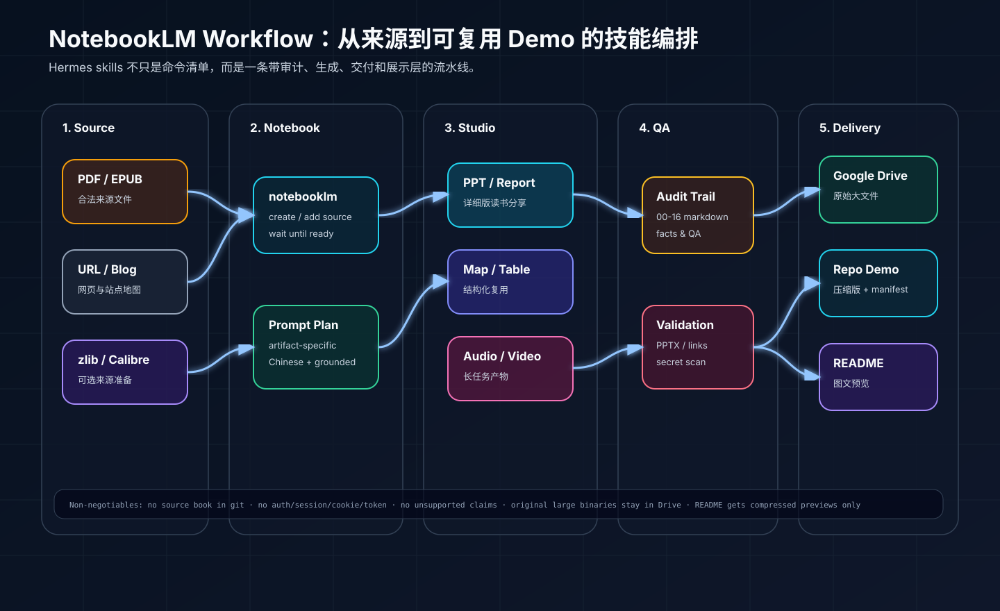
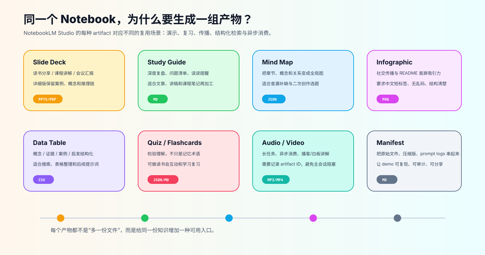
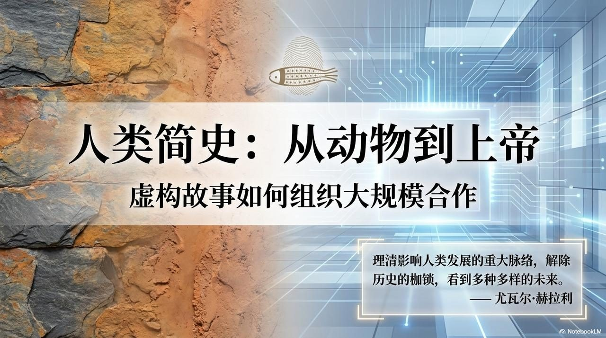
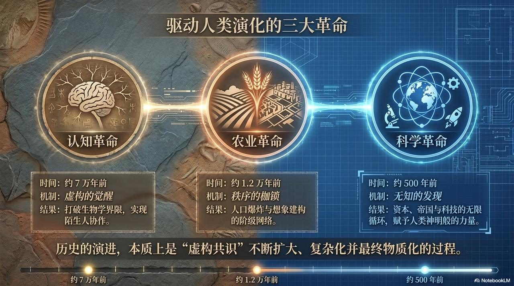
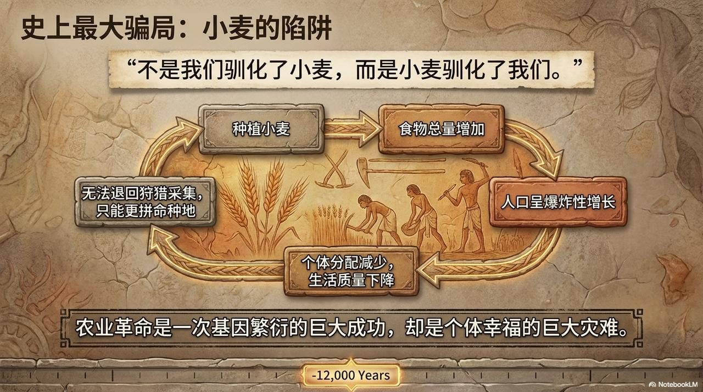
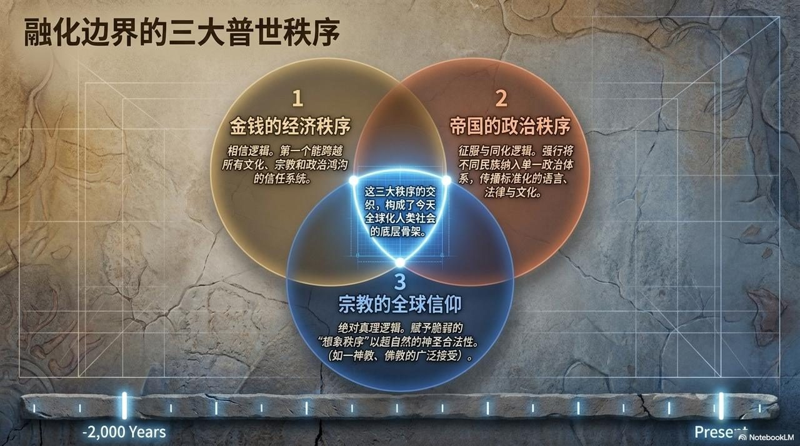
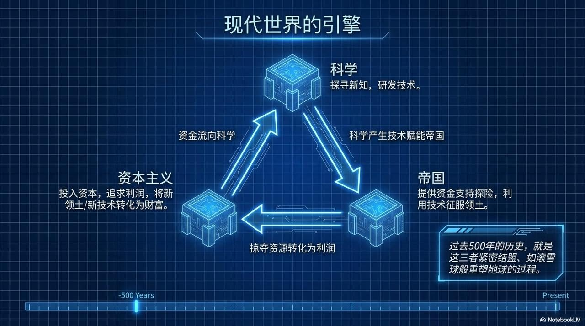
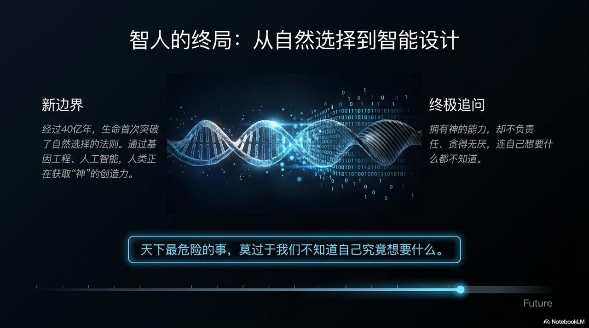
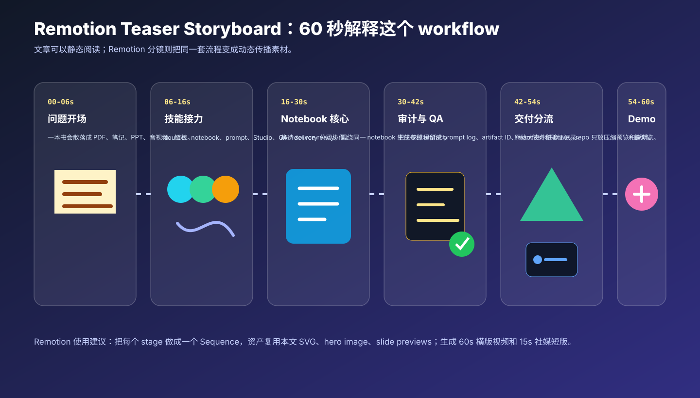

# 一条把书变成 NotebookLM 作品集的自动化流水线

> 这篇文章解释 `notebooklm-workflow` 是如何工作的：它不是一个单点脚本，而是一组 Hermes skills 组合成的知识生产流水线。输入可以是一本书、一个 PDF/EPUB、一批 URL 或一个现有 NotebookLM notebook；输出可以是 PPT、学习指南、思维导图、信息图、数据表、测验卡片、音频/视频，以及一个可以放进 GitHub README 的 demo。


## 1. 为什么需要 workflow，而不是只让 NotebookLM “生成一下”？

NotebookLM 很适合基于来源生成内容，但真实工作里通常会遇到四个问题：

1. 来源准备不稳定：PDF、EPUB、URL、博客、已有书籍文件，各自需要不同处理方式。
2. 产物类型很多：PPT、报告、mind map、infographic、quiz、flashcards、audio、video 的 prompt 不应该一样。
3. 生成后还要交付：PPTX/MP4 往往很大，聊天工具可能传不上去，需要 Drive 原件 + repo 压缩预览。
4. 最终还要可复用：只把文件丢给用户不够，最好留下 prompt、artifact ID、manifest、截图和 QA 记录，让下一本书可以复刻。

所以这个仓库的核心不是“一个命令生成所有东西”，而是把知识生产拆成几个可审计的阶段。



## 2. Skills 的分工：每个 skill 只负责流水线的一层

`notebooklm-workflow` 里的 skills 可以理解为六层：

| 层级 | 代表 skills | 解决的问题 |
|---|---|---|
| 来源获取与准备 | `zlibrary-cli`、`epub-2-pdf`、`upload-books-to-notebooklm`、`blog-2-notebooklm` | 把合法来源变成 NotebookLM 可摄取的文件或 URL。 |
| Notebook 操作 | `notebooklm` | 创建 notebook、上传来源、等待 source ready、生成和下载 artifacts。 |
| 读书分享 PPT 工作流 | `notebooklm-book-ppt-workflow` | 从书中提取结构、观点、案例、时间线、概念、引语，并在生成 PPT 前做事实检查。 |
| Studio 产物质量 | `notebooklm-studio-quality-prompts` | 为 PPT、报告、信息图、quiz、音视频等分别设计高质量 prompt。 |
| 富信息量幻灯片 | `notebooklm-rich-slide-decks` + PowerPoint tooling | 避免稀疏卡片式 PPT，压缩图片型 PPTX，抽取预览页，做视觉 QA。 |
| 交付与展示 | `notebooklm-artifacts-to-drive` | 原始大文件进 Google Drive；repo 里只放 prompt logs、manifest、压缩版和截图。 |

这种设计的好处是：每个 skill 都很窄，但组合起来能覆盖完整项目生命周期。用户说“做一套读书分享 PPT”，Agent 会加载 book-PPT workflow；用户说“把产物放上来”，Agent 会切到 artifacts-to-drive 的 repo-friendly 流程。

## 3. 一次完整运行发生了什么？

一次端到端运行通常是这样的：

```text
Prepare source
  -> optional: zlib search/download, EPUB->PDF conversion, PDF verification
Create/reuse NotebookLM notebook
  -> add source(s), wait until ready
Plan prompts
  -> artifact-specific prompts for PPT/report/map/infographic/table/quiz/flashcards/audio/video
Generate artifacts
  -> save generation JSON/logs and artifact IDs
Download completed artifacts
  -> PPTX/PDF/PNG/CSV/MD/JSON/MP4/MP3 as available
QA and package
  -> source-grounding check, PPTX archive check, visual/text checks, file-size check
Deliver
  -> original full-quality files to Drive; compressed copies/previews to repo when needed
Document
  -> README/demo manifest with links, prompts, screenshots, and reproduction notes
```

这条链路的关键是“状态可恢复”。例如视频生成很慢，就不要让主会话一直等；记录 artifact ID 和 prompt log 后，后续可以继续查状态、下载、上传、压缩。

## 4. 为什么同一本书要生成这么多产物？

同一个 NotebookLM notebook 是知识源；不同 artifact 是不同使用场景的入口。



- PPT 适合讲解和读书分享。
- Study guide 适合深读和文章再加工。
- Mind map 适合看全局结构。
- Infographic 适合传播和 README 首屏展示。
- Data table 适合结构化复用。
- Quiz / flashcards 适合学习和互动。
- Audio / video 适合异步消费。
- Manifest 则把所有产物、prompt 和原始链接串起来。

这也是为什么 demo 里既有 Drive 原件，也有 GitHub 压缩预览：Drive 是交付层，GitHub 是展示层。

## 5. 读书分享 PPT：先提取事实，再生成幻灯片

对书籍类任务，最容易踩坑的是“模型知道这本书，所以顺手补了书外知识”。`notebooklm-book-ppt-workflow` 的约束正好相反：所有章节、案例、人物、年份、引语和结论都必须来自 NotebookLM 的来源提取。

它会要求保留一组中间文件：

```text
00_source_check.md
01_book_structure.md
02_core_ideas.md
03_key_cases.md
04_timeline.md
05_people.md
06_concepts.md
07_quotes.md
08_misreadings.md
09_reader_takeaways.md
10_content_brief.md
11_slide_outline.md
12_slide_script.md
13_fact_check.md
14_slide_script_verified.md
15_ppt_content_qa.md
16_ppt_visual_qa.md
```

这组文件看起来繁琐，但它解决了三个问题：

1. 可追溯：PPT 里每个重要内容都能回到提取文件。
2. 可修改：如果用户不满意结构，可以改 outline，而不是重跑全部。
3. 可复用：下一本书可以沿用同样的工作目录和 QA checklist。

下面是《人类简史》demo 中抽出的几页 PPT 预览。它们展示了一个理想读书分享 deck 应该覆盖的范围：封面、核心框架、关键论点、综合结构、现代机制和未来收束。

| Cover | Three revolutions | Wheat trap |
|---|---|---|
|  |  |  |
| Universal orders | Modern engine | Future DNA |
|  |  |  |

## 6. Demo 的目录为什么这样设计？

一个可复用 demo 需要同时服务三类读者：

- 想看效果的人：直接看 README 图片。
- 想复现的人：看 prompts 和运行步骤。
- 想审计的人：看 Drive manifest、prompt logs、压缩策略和 QA checklist。

推荐目录是：

```text
demos/<slug>/
  README.md                         # workflow narrative, screenshots, QA checklist
  prompts/                          # reusable artifact prompts
  assets/                           # mockups and README preview images
  drive_outputs/                    # prompt logs + manifest linking original Drive files
  compressed_outputs/               # compressed PPTX/PDF/MP4 review copies
```

在《人类简史》demo 里：

- `drive_outputs/` 记录真实 Drive 产物和 prompt logs；
- `compressed_outputs/` 放压缩后的 PPTX/PDF/MP4，方便 GitHub 浏览；
- `assets/slide-previews/` 放几页代表性 JPG；
- `prompts/` 放每种 Studio artifact 的高质量 prompt。

## 7. 用 Remotion 把 workflow 讲成一个 60 秒视频

文章适合解释细节，但 workflow 本身也适合做成动态短片：来源进入流水线，经过技能接力、NotebookLM 生成、QA、Drive/repo 分流，最后变成 demo。



这个仓库附了一个可改造的 Remotion 组件草稿：

```text
docs/assets/notebooklm-workflow/remotion-workflow-teaser.tsx
```

它把 60 秒视频切成 6 个 Sequence：

| 时间 | 段落 | 内容 |
|---|---|---|
| 00-06s | 问题开场 | 一本书的知识会散落成很多文件和产物。 |
| 06-16s | 技能接力 | source、notebook、prompt、Studio、QA、delivery 分层协作。 |
| 16-30s | Notebook 核心 | 等待 source ready，围绕同一 notebook 生成多种 artifact。 |
| 30-42s | 审计与 QA | 保存 prompt log、artifact ID、manifest 和验证记录。 |
| 42-54s | 交付分流 | 原始大文件进 Drive，repo 只放压缩预览和说明。 |
| 54-60s | Demo | README 可以直接浏览，Drive 打开原始文件。 |

实际落地时，可以把本文的 SVG、hero image、PPT preview images 作为 Remotion 资产，生成一个 60 秒横版视频和一个 15 秒社媒短版。

## 8. 给 Agent 的推荐调用方式

你可以直接这样对 Hermes/Codex 说：

```text
使用 notebooklm-workflow 的 skills，把这本书做成一个 NotebookLM 读书分享 workflow：
1. 使用我提供的合法 PDF/EPUB 作为来源，不要加入书外知识；
2. 创建或复用 NotebookLM notebook，等待 source ready；
3. 生成：详细 PPT、学习指南、思维导图、信息图、数据表、quiz、flashcards、audio/video overview；
4. 每类 artifact 使用对应的高质量 prompt，保存 prompt log 和 artifact IDs；
5. 原始大文件上传到 Google Drive 的 NotebookLM/<notebook name>/；
6. 如果要放进 repo，只提交 prompt logs、manifest、压缩预览版和 README 截图，不提交书籍 PDF、认证信息或大型原始二进制。
```

如果只想做 PPT，可以更窄：

```text
使用 notebooklm-book-ppt-workflow，基于当前 NotebookLM notebook 做一套中文读书分享 PPT。
请先从 NotebookLM 来源中提取结构、核心观点、案例、时间线、概念、引语和误读风险，生成 content brief 和 slide outline，完成 fact check 后再生成 PPT。
不要加入书外知识。最终把原始 PPTX/PDF 上传 Drive，并在 repo demo 中放压缩版和几页 README 预览图。
```

## 9. 这条 workflow 的边界

这条流水线刻意保守：

- 不把书籍 PDF 或受版权保护的原文提交进 git。
- 不提交 NotebookLM auth storage、Google OAuth token、cookies、Z-Library session。
- 不自动绕过 Z-Library 额度或访问控制。
- 不把大型原始 PPTX/PDF/MP4 塞进 git 历史。
- 不让 PPT 内容来自模型记忆，而是来自 NotebookLM 的来源提取和 fact check。

换句话说，它追求的不是“最快生成一个文件”，而是让生成过程可以复查、可以交付、可以复用。

## 10. 最终效果：workflow 变成项目资产

当这套 workflow 跑完后，仓库不只是多了一堆文件，而是多了一个可演示、可复刻的案例：

- README 直接展示 infographic 和 PPT 预览页；
- demo 目录保存 prompts、压缩产物和 Drive manifest；
- 原始高质量文件仍在 Drive；
- 下一次处理另一本书时，可以复用同样的 skill stack 和目录结构。

这就是 `notebooklm-workflow` 的目标：把 NotebookLM 从一个单次生成工具，变成一条可审计、可展示、可复用的知识生产流水线。
